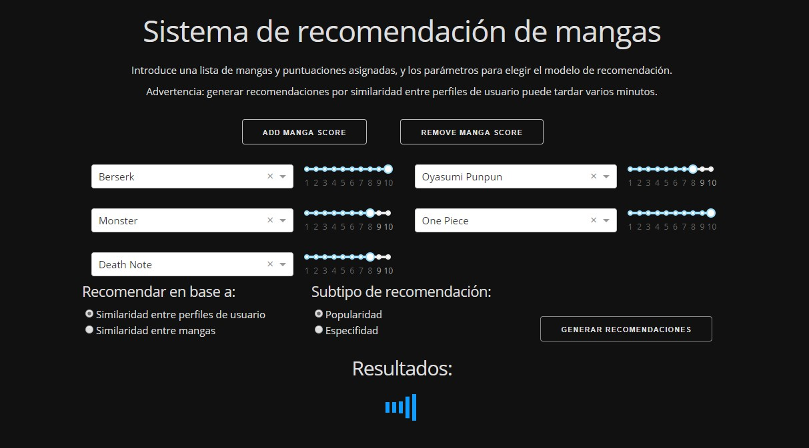
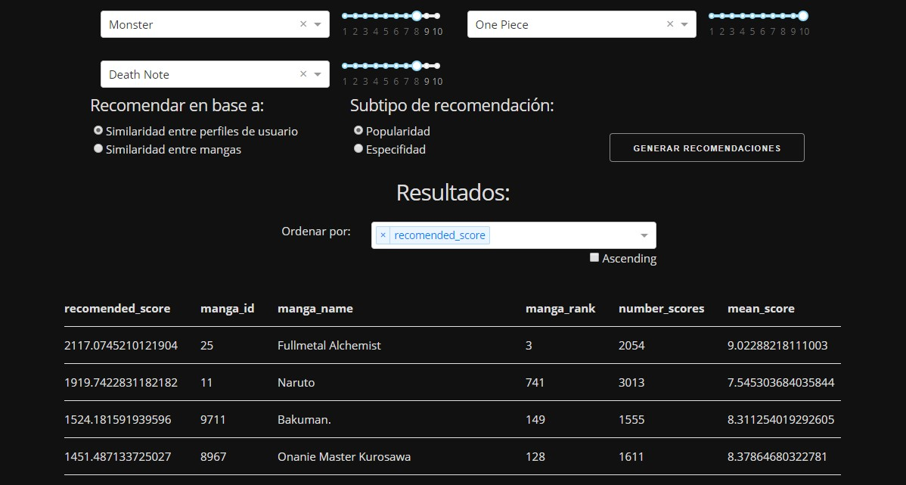

##  Reccomender System

This is a project I did for the Big Data & Data Science Master's degree I was studying in 2019. While 
the homework was to put some recommender system into theory, I scraped some of the content of 
[MyAnimeList](https://myanimelist.net), got a little creative with the idea, and set up a GUI using 
Dash to see a whole manga's recommender system working properly.

I recently cleaned it up to share it here. It still has some parts in Spanish, and some code is a bit
rusty (guess I had no practice with numpy and pandas).

Screenshots:

